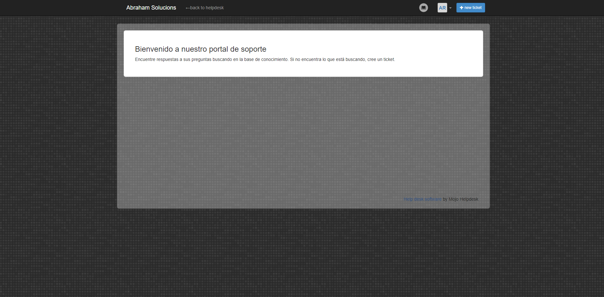

**Introducción**

**Mojo Helpdesk** es la aplicación de servicio técnico súper simple de usar para
atención al cliente, solicitudes de TI, solicitudes de mantenimiento y mucho
más.

Versiones

**Características de la versión que utilizaremos:**

-   4 colas

>   *Una cola de tickets es como una carpeta o una categoría. Se utilizan para
>   organizar las entradas. Los nombres típicos de las colas son 'Soporte
>   técnico', 'Preguntas sobre mi cuenta', 'Solicitud de compra'.*

-   2 formularios personalizados

>   *Mojo soporta múltiples formas. Por ejemplo, una organización puede
>   necesitar un formulario de "Solicitud de Boleto", un formulario de
>   "Devolución de RMA" y un formulario de "Solicitud de Compra". Elija un plan
>   basado en sus necesidades específicas*.

-   3 disparadores

>   *Automatice el flujo de trabajo creando disparadores. Los activadores actúan
>   en los tickets inmediatamente después de crearlos, actualizarlos o
>   eliminarlos.*

-   Helpdesk para almacenamiento de archivos 50MB / agente

>   *Adjunte capturas de pantalla, fotografías, documentos o cualquier otro tipo
>   de archivo para ayudar a resolver una solicitud de soporte.*

-   Tamaño máximo del archivo de 1 MB

>   *Podrá adjuntar archivos hasta el tamaño máximo de archivo para cada plan.*

-   2 vistas personalizadas

>   *Cree vistas personalizadas para sus listas de tickets, filtradas por los
>   criterios que especifique.*

-   2 respuestas enlatadas

>   *Acelere su trabajo utilizando respuestas preexistentes.*

-   Integración de Google

>   *Instale Mojo Helpdesk en Google Apps para iniciar sesión directamente en
>   Mojo desde Google Apps.*

-   Widget de soporte

>   *Con el widget de soporte, puede colocar un formulario de ticket
>   directamente en su sitio web*

-   Datos de importación

>   *Importar datos de usuario y ticket.*

-   Seguridad básica

>   *Si necesita la máxima seguridad y confidencialidad, puede cifrar todos los
>   intercambios de información (no solo relacionados con las contraseñas) con
>   nuestra tecnología de encriptación sólida.*

-   Grados de satisfacción del usuario

>   *El Número Mojo es su medida de éxito: cada boleto puede ser calificado por
>   el usuario. El número Mojo refleja la satisfacción del cliente en función de
>   las calificaciones, para que pueda ver cómo le está yendo a su organización
>   y al personal con la satisfacción del cliente. ¿Cuál es tu número de mojo?*

-   100 usuarios

>   *Los usuarios son aquellos que envían tickets al servicio de asistencia,
>   también conocido*

>   **Instalación:**

Vamos a la pagina “https://www.mojohelpdesk.com/pricing/” y seleccionamos la
versión MINI ME

	
Ahora rellenamos los campos para registrarnos y crear nuestro portal. (El número
de teléfono es inventado y el correo es temporal para hacer esta práctica)

Este es la pantalla de inicio de nuestro Helpdesk.

Ahora una vez creado podríamos editar a nuestro gusto (dentro de las
limitaciones de la versión trial) nuestro portal de asistencia. Para llegar
hasta este punto iremos en la parte superior derecha, haremos click en la rueda
dentada y click en Admin Settings.

1.  Antes de pasar al apartado cliente editaremos el apartado del portal de cara
    al cliente.

    
    Vamos al apartado de **Helpdesk design** y cambiamos el fondo.

	

    1.  Ahora el apartado de texto que verá el usuario que será en el apartado
        **Help Center Settings**.

1.  Este seria un aspecto final.

**Apartado Usuario**

1.  El cliente no tiene que instalar ni hacer nada solo entrar a la página web.
    *https://abrahamsolucions.mojohelpdesk.com/* (se encuentra con la misma el
    portal que la foto anterior).

Para crear una incidencia o ticket haremos click en *New ticket*.

Rellenamos ahora el ticket y lo enviamos.

**Apartado administrador**

Ahora nos llegaría la incidencia.

Ahora abriremos la incidencia y le respondemos.

Y esto es lo que se encontraría el cliente el correo.

**Conclusión.**

Me he esperado una aplicación de tener que instalar base datos y mucho más cosas
pero es una herramienta simple pero completa (siempre que pagues más o menos)
con solo registrarte ya tiene acceso al portal y el cliente con solo entrar a la
url puede crear las incidencias.
